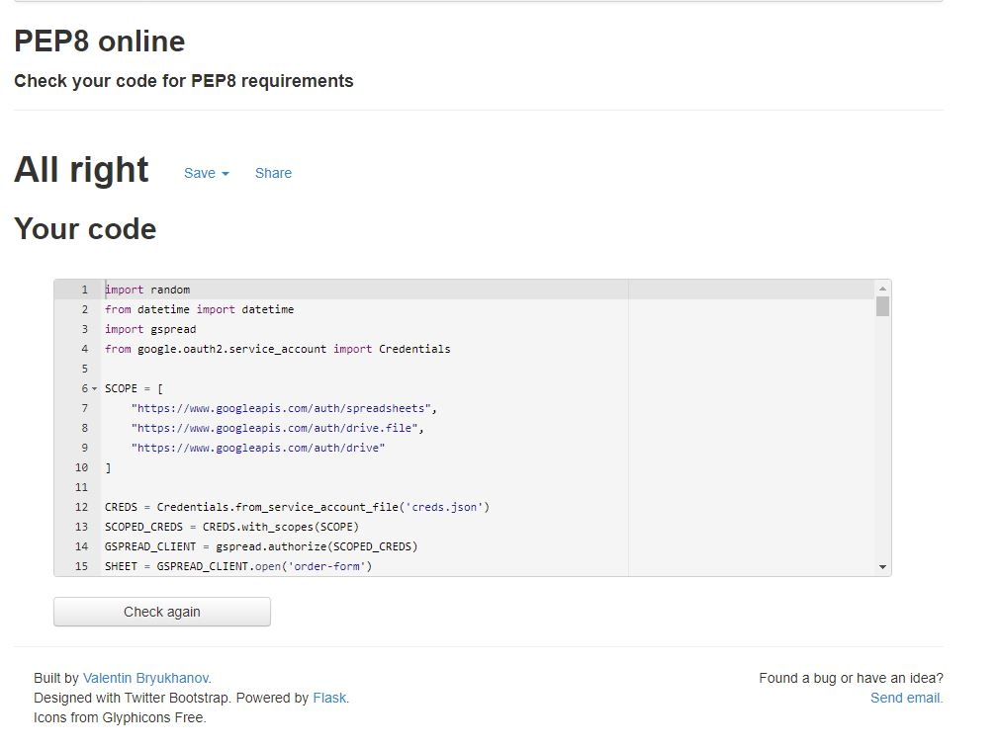

<h1>Order Form for Delivery Business</h1>

For this project, I am working on a real-world requirement at my current job. This application suits the requirements of the company as they stand, and can be developed further as the business develops.

This program was developed based on the requirements of the client. The client is a company who produce and deliver food and utensils to schools in Ireland. At the moment, this online ordering facility is only available at two locations while it is being tested, but it is expected to expand nationwide.

The aim of this program is to streamline the ordering facility. The requirements in the brief are:

<ol>
    <li>To allow customers and staff to place an order in a user friendly manner</li>
    <li>To collate that data into an order log</li>
    <li>To assign a Production Run reference to each order</li>
</ol>

The program should prevent:

<ol>
    <li>Orders being placed for schools in counties where delivery is not available</li>
    <li>Delivery Date is in the past</li>
</ol>

Notes on scaleability: This project is designed to meet the current workflow processes of the company. However, work is ongoing to develop a detailed and restricted list of items available to order as well as a detailed internal stock control and material planning system. This order form can be updated to facilitate the more restricted data in the future.

 

<h1>How to Use:</h1>
<h2>NOTES: Delivery is currently only available in counties OFFALY and DUBLIN - choosing another county will throw an error.</h2>
<h3>To Place an Order: </h3>
<ol>
    <li>Enter your School Name - starting with the COUNTY - and press ENTER/RETURN. For Example: Dublin St. Mary's</li>
    <li>Enter your desired delivery date and press ENTER/RETURN</li>
    <li>Enter your order details and press ENTER/RETURN</li>
</ol>
<h3>To Review and process an Order: </h3>
<ol>
    <li>Open the order-form google sheet</li>
    <li>Choose the appropriate delivery date from the filter</li>
    <li>Process orders and reference the prun reference number</li>
</ol>
 
<h1>Features</h1>
 
<h3>Existing Features</h3>
<ul>
    <li>Allow user to enter their school name to place an order</li>
    <li>Allow users to select their desired delivery date</li>
    <li>Auto generate a Production Run reference to speed up the production process</li>
</ul>
 
<h3>Future Features</h3>
<ul>
    <li>Add more counties to the order feature as required</li>
    <li>Develop a database of items available to order and assign pricing</li>
    <li>Generate sales and revenue data based on the database of items available to order</li>
</ul>
 
<h1>Testing</h1>
 

I have manually tested this project by doing the following:

<ul>
    <li>Passed the code through a PEP8 linter and confirmed there are no problems</li>
    <li>Provided invalid inputs at all stages of building this program to identify bugs; invalid county, invalid date.</li>
    <li>Tested in my local terminal and the Heroke Terminal</li>
</ul>

<h2>Bugs</h2>
<h3>Solved Bugs</h3>
<ul>
    <li>When writing this program I came across an issue with validating the date so that it was both in the future and also a valid format. I resolved this by using date format validation code (credit below) and by converting the date string to a date object and checking this against today's date.</li>
    <li>Halfway through the project, the data started to be written to the wrong column in GoogleSheets. This was identified to be the order in which the functions were written inside main() and this was resolved. </li>
</ul>
<h3>Remaining Bugs</h3>
<ul>
    <li>no bugs remain</li>
</ul>
<h3>Validator Testing</h3>
<ul>
    <li>PEP8 - no errors returned</li>
</ul>
 
<h1>Deployment</h1>

This project was deployed using Heroku

<h4>Steps for deployment</h4>
<ul>
    <li></li>
</ul>
 
<h1>Credits</h1>
<ul>
<li>DATE VALIDATION - date format validation was written by the authors at tutsmake.com and I am extremely grateful for their assistance. The link to this article can be found <a href="https://www.tutsmake.com/python-program-to-check-the-given-date-is-valid-or-not/
">here</a></li>
<li>DATE VALIDATION - date validation to check that the delivery date is in the future was provided by a user on StackOverflow.com and the link to this can be found <a href="https://stackoverflow.com/questions/3642892/calculating-if-date-is-in-start-future-or-present-in-python">here</a></li>
</ul>
